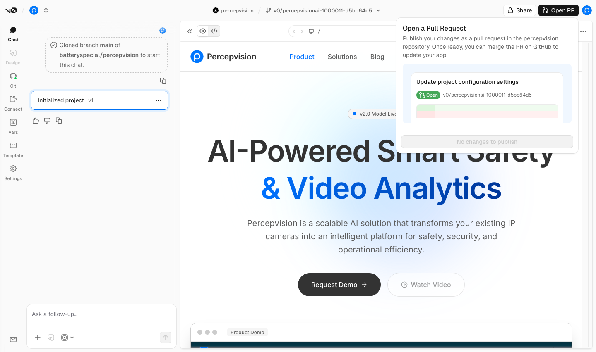

# Percepvision Content Management & Deployment Guide

This guide outlines the streamlined workflow for the marketing team to update and maintain the __percepvision.com__ website. By leveraging AI-assisted tools like __v0__ and __aura.build__, you can manage high-quality design changes and blog updates without deep knowledge of Next.js or React.

---

## Tools Overview

| Tool | Purpose |
| --- | --- |
| __aura.build__ | The visual design environment. Used to generate initial HTML/CSS. |
| __v0.app__ | The AI-powered code editor. Used to convert designs into functional Next.js code and handle GitHub Pull Requests (PRs). |
| __Gemini / AI__ | Used for small, logic-based code tweaks to save v0 credits. |
| __GitHub__ | The code repository where final changes are reviewed and merged. |
| __Vercel__ | The hosting platform that automatically deploys the site after a merge. |

---

## Project Structure Reference

Understanding where files live helps when the AI asks where to save a change.

| Folder/File | Category | Description |
| --- | --- | --- |
| `app/blog/[slug]/` | __Content__ | The template for individual blog posts. `[slug]` represents the unique URL ID. |
| `app/solutions/` | __Pages__ | Contains the layout and content for the "Solutions" page. |
| `app/contact/` | __Pages__ | Contains the "Contact Us" page and its logic. |
| `components/` | __UI Elements__ | Reusable parts of the site like the `navbar.tsx`, `footer.tsx`, and `contact-form.tsx`. |
| `lib/` | __Data/Logic__ | Stores utility functions and the raw data for blogs (`blog-data.ts`). |
| `public/` | __Assets__ | Where images, icons, and static files are stored. |
| `styles/` | __Design__ | Global CSS files that control colors and fonts across the whole site. |

---

## The Workflow

### Large Changes (New Pages or Redesigns)

*Best for: New blog posts, new service pages, or complete section overhauls.*

1. __Design:__ Build your layout in __aura.build__.
2. __Export:__ Click the "Code" button in aura.build and copy the static HTML.
3. __Import to v0:__ Go to the [percepvision project on v0](https://v0.app/chat), paste the HTML, and ask the agent to integrate it into the existing site structure.
> __Pro Tip:__ To save monthly credits, batch your work. Upload 4–5 pages at once so the AI agent can process them in one major "delivery."
4. __Sync:__ Once satisfied with the preview in v0, click __"Open PR"__ in the top right corner. It will take you to GitHub, __if and only if__ you have collaborator access.
5. Email __infinityscrub74@gmail.com__ with your github username / email for access.

---

### Minor Changes (Text or Small Components)

*Best for: Fixing a typo, changing a button color, or updating a single component.*

1. __Isolate:__ Copy the specific component code from __aura.build__ or the GitHub repository.
2. __Refine with Gemini:__ Paste the code into [Gemini](https://gemini.google.com) or another LLM. Ask for the specific change (e.g., *"Change the heading text to 'Our Vision' and make the button blue"*). This is free and saves your v0 credits.
3. __Preview:__ Paste the modified code back into __v0__ to see a live visual update.
4. __Submit:__ Open a PR via v0 or directly on GitHub.

---

## Deployment & Review

Once a Pull Request (PR) is opened on GitHub:

1. __Review:__ * For __small changes__: If you are confident, click __"Merge"__.
* For __sweeping changes__: Add a reviewer to the PR before merging.
2. __Build:__ Vercel will automatically start building the site. You can click __"View on Vercel"__ in the GitHub PR comments to watch the progress.
3. __Verify:__ Once the build is complete, visit [percepvision.com](https://percepvision.com) to ensure the live site reflects your changes.
x

---

## Troubleshooting & Conflicts

Sometimes, two people might edit the same file, causing a __Merge Conflict__. If GitHub flags a conflict that you cannot resolve:

* __Do not force a merge.__
* __Contact Support:__ Send an email to __infinityscrub74@gmail.com__ with a link to the PR.
